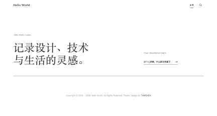

# Tamshen

一款简洁、克制的 Typecho 博客主题，适合记录设计、技术与日常内容。主题以清晰的文字层级、细线条和留白为主，兼顾桌面端与移动端阅读体验。



## 功能

- 响应式首页、分类、标签、作者和搜索结果
- 文章目录、图片灯箱、代码高亮与 Mermaid 流程图
- AJAX 评论、回复、管理员删除和评论模态框
- 归档与友情链接自定义页面
- 主题配置备份与恢复
- 本地 Vendor 与可选 CDN 回退
- CSS/JavaScript 兼容构建和 ZIP 发布工具

## 安装

1. 下载发布包 `tamshen-版本号.zip`。
2. 解压到 Typecho 的 `usr/themes/`，确保目录名为 `tamshen`。
3. 在 Typecho 后台进入“控制台 → 外观”，启用 Tamshen。
4. 进入主题设置完成首页、Logo、页脚和前端功能配置。

主题优先加载 `style.min.css` 和 `theme.min.js`；发布包已经包含压缩资源，无需在服务器安装 Node.js。

## 主题设置

- 导航 Logo：留空时显示站点标题。
- 首页导语：配置首页标签和主标题，主标题支持换行。
- 默认封面：文章没有 `cover`、`thumb` 或正文图片时使用。
- 社交链接：每行填写 `名称|URL`。
- 代码高亮：默认开启。
- Mermaid：默认关闭，仅在需要时开启。
- Vendor CDN：开启后优先使用 CDN，失败时回退本地资源。
- 页脚：配置版权起始年份和主题设计署名。

“备份配置”会将当前主题设置写入 `config.php`；“恢复配置”会使用该文件覆盖数据库中的主题设置。

## 自定义页面

### 归档

新建独立页面，并选择“时间归档”模板。页面会按年份展示全部文章。

### 友情链接

新建独立页面，选择“友情链接”模板，并添加自定义字段 `linksJson`。字段值为 JSON 数组：

```json
[
  {
    "name": "Typecho",
    "url": "https://typecho.org",
    "description": "Typecho 官方站点",
    "image": ""
  }
]
```

`name` 和 `url` 必填，`description` 和 `image` 可留空。友情链接页面支持正文内容和评论。

## 开发

需要 Node.js 18 或更高版本。主题没有前端框架，直接编辑 PHP、CSS 和 JavaScript：

- 样式源文件：`static/css/style.css`
- 脚本源文件：`static/js/theme.js`
- 模板与配置：根目录 PHP 文件
- PHP 辅助逻辑：`function/`
- 构建工具：`tools/`

`style.min.css` 和 `theme.min.js` 是生成产物，禁止直接编辑。开发前删除这两个文件，主题会自动回退加载源文件。开发期间不需要执行构建。

常用检查：

```sh
find . -maxdepth 2 -name '*.php' -exec php -l {} \;
node --check static/js/theme.js
cd tools
npm install
npm run css:audit
```

## 发布

发布版本来自 `index.php` 文件头中的 `@version`，同时用于 CSS/JavaScript 缓存参数和 ZIP 文件名。发布前先更新版本号，然后执行：

```sh
cd tools
npm install
npm run package
npm run check
```

`npm run package` 会自动构建压缩资源，并输出：

```text
dist/tamshen-版本号.zip
```

压缩包包含可直接安装的 `tamshen/` 顶层目录，不包含 Git 数据、开发工具和 Node.js 依赖。

## 兼容性

最低浏览器基线：

- Chrome / Edge 84+
- Firefox 78 ESR+
- Safari 14.1+

View Transitions 和原生图片懒加载采用渐进增强，不支持时会自动使用普通行为。

## License

第三方资源许可证位于 `static/js/vendor/`。主题设计与开发：[@Tamshen](https://github.com/Tamshen)。
